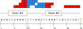

sam2irs
=======

Introduction
------------

sam2irs is a program for calculating intron retention scores (IRS') using input in the sequence alignment/map (SAM) format.  It was developed using Perl but a C++ version is in development.

This document accompanies:

  * source code in Perl,
  * licensing information, and
  * a small data file for testing.

The manuscript that makes use of this software is currently in preparation.  It is [available](https://papers.ssrn.com/sol3/papers.cfm?abstract_id=3385139) for download in Cell Press' Sneak Peak service:

    L. Yue, R. Wan, S. Luan, and T. H. Cheung.  Dek Modulates Global Intron Retention to Control Quiescence Exit in Muscle Stem Cells.  In preparation.

Requirements
------------

|Software                |Version  |Required?  |Ubuntu package   |Anaconda package |
|:----------------------:|:-------:|:---------:|:---------------:|:---------------:|
|Perl                    | 5.22.0  | Yes       |perl             |perl             |
|AppConfig (Perl module) | 1.71    | Yes       |libappconfig-perl|perl-appconfig   |

Experiments with this software have been successfully run on Linux systems running:
  * CentOS 6.9 64-bit and
  * Ubuntu 18.04 and 19.04

The versions represent the tools used during software development or when running the experiments in the paper. They do not represent the minimum requirements; it is possible that lower versions can be used.

Organization
------------

After cloning this repository from GitHub, the following directory structure is obtained:

    ├── Cpp                     C++ version of sam2irs (in development).
    ├── Examples                Examples to test sam2irs against.
    │   ├── test1.*             Files related to a very simple test case (see below).
    ├── LICENSE                 Software license (GNU GPL v3).
    ├── Perl                    Perl version of sam2irs.
    └── README.md               This README file.

Input/Output Format
-------------------

### Input

As input, sam2irs requires:

1.  A list of chromosomes;
2.  A list of the exons of each gene (in the gene transfer format, [GTF](https://asia.ensembl.org/info/website/upload/gff.html)); and
3.  The aligned reads (in the Sequence Alignment/Map format, [SAM](http://www.htslib.org/doc/sam.html)).

The list of chromosomes is a tab-separated file, with each row corresponding to a chromosome.  Each row has two fields.  The first is the name of the chromosome and the second is the length of the chromosome in base pairs.

### Output

The output is in [GTF](https://asia.ensembl.org/info/website/upload/gff.html).  The second field is the "source" -- that is, the program that performed the calculation.  In our case, it is always "sam2irs".  The third field is the feature type, which is always "intron" (a non-standard feature type which we have used).

The ninth and last field is a set of attributes separated by semi-colons.  In these attributes, we list the following information:

  * name -- name of the gene associated with this intron
  * count -- number of bases aligned to this intron
  * width -- width of the intron
  * aligned_reads -- number of reads that were aligned (used for normalisation)
  * aligned_bases -- number of bases that were aligned (used for normalisation)

The number of aligned reads and bases is the same for every feature.  While inefficient in terms of disk space, this allows each row to be normalised independently.

Method
------

The sam2irs script proceeds as follows:

  1.  Read in the list of chromosomes to consider.
  2.  Read in the list of exons:
    * Exclude genes from chromosomes that are are not to be considered (i.e., usually unassigned scaffolds, etc.).
    * Exclude predicted genes that start with "Gm".
    * Exclude all features (as indicated by the third field of the GTF format) that are not exons.  More specifically, the features "CDS", "start_codon", and "stop_codon" are dropped.
  3.  Read in the aligned reads.
  4.  Process each chromosome of the genome one-by-one (see below).
  5.  Output the intron retention scores.
  6.  If the --samrecord argument is provided, then print to file the "classification" of each read.

In essence, the script creates multiple arrays, with each array equal in size to the length of the chromosome under consideration.  These arrays might indicate the gene associated with a particular location (thus, if more than one gene is associated with a single location, then it is an overlapping gene); whether the position is an intron or an exon; and the number of bases aligned to that position.  In the Perl version of sam2irs, the names of these 3 arrays are `gene_chr_array`, `exon_chr_array`, and `freq_chr_array`, respectively.

The main part of the script is step #4, which processes each chromosome one-by-one.  The main steps this part of the script is as follows:

  1.  Record the starting and ending position of each gene (since the GTF file does not have to be sorted by location) in a set of dictionaries.
  2.  For each gene, mark the area between its starting and ending position.  Overlapping areas imply overlapping genes.  If this happen, the genes in question (i.e., potentially 2 or more) are discarded.
  3.  For each remaining gene, mark the entire area between the starting and ending position as an "intron" as a form of initialisation.  Afterwards, go back and indicate the location of the exons.  Thus, this "collapses" all of the exons of a gene's isoforms so that intronic regions are those regions which are introns for all isoforms of the gene.
  4.  For each aligned read, use the CIGAR string to indicate how many bases aligned at each position of the chromosome.  Also record whether the read aligns to an exon, an intron, both intron and exon (i.e., it straddles the boundary between the two), or neither.

Running example
---------------

### test1

In the Examples/ directory there is a simple example that depicts how IRS is calculated.  This example consists of one chromosome, one gene, and 6 aligned reads of 6 base pairs in length each.  The gene has two exons.  Bases that lie within an intron are in blue; all other bases are in red.  This is illustrated in the following image (the first position is 1):

Type the following to process this example:

  * `cat test1.sam | ../Perl/sam2irs.pl --verbose --chrlist test1.genome --gtf test1.gtf 2>/dev/null`

With standard error sent to /dev/null, the output will be a single line in GTF format:

chr1    sam2irs        intron  11      17      15      -       0       name=Test;count=15;width=7;aligned_reads=6;aligned_bases=36;

This output indicates that the chromosome "chr1" has an intron from position 11 to 17 (endpoints are 
included in the interval), which has 15 intronic bases.  The width of this region is 7 base pairs.  The total number of aligned bases is 36 for the entire data set.

The intron retention score is:  (15 / 7) / 36.

Note that sam2irs itself does not calculate this score.  A single additional pass over the output is needed.

Future Work
-----------

A hopefully faster implementation in C++ is currently being developed.

About sam2irs
-------------

This software was implemented while I was at the Hong Kong University of Science and Technology.  My contact details:

     E-mail:  rwan.work@gmail.com 

My homepage is [here](http://www.rwanwork.info/).

The latest version of sam2irs can be downloaded from [GitHub](https://github.com/rwanwork/sam2irs).

If you have any information about bugs, suggestions for the documentation or just have some general comments, feel free to contact me via e-mail or GitHub.

Copyright and License
---------------------

     sam2irs (SAM to intron retention score calculator)
     Copyright (C) 2016-2019 by Raymond Wan

sam2irs is distributed under the terms of the GNU General
Public License (GPL, version 3 or later) -- see the file COPYING for details.

Permission is granted to copy, distribute and/or modify this document under the
terms of the GNU Free Documentation License, Version 1.3 or any later version
published by the Free Software Foundation; with no Invariant Sections, no
Front-Cover Texts and no Back-Cover Texts. A copy of the license is included
with the archive as COPYING.DOC.

Saturday, May 25, 2019

